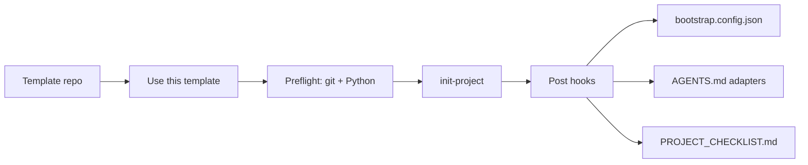

# agent-project-bootstrap


[](https://github.com/edwardlthompson/agent-project-bootstrap/actions/workflows/ci.yml)
[](https://securityscorecards.dev/viewer/?uri=github.com/edwardlthompson/agent-project-bootstrap)
[](https://codespaces.new/edwardlthompson/agent-project-bootstrap)

**Ship a FOSS app with an agent that already knows the rules.**

Most templates hand you empty folders. This one hands you a working contract: one [`AGENTS.md`](AGENTS.md) that Cursor, Windsurf, Antigravity, Claude Code, Copilot, Aider, Cline, and Continue all follow — plus CI, security, and a 10-minute tour so a first-time human is not lost.

Click **Use this template**, run init, then type `/tour` (or ask any agent to read [`docs/help/TOUR.md`](docs/help/TOUR.md)). You leave Sprint 0 with a checklist, a Golden Path you can run, and gates that say *what failed* and *what to run*.

## Why this exists

Starting a public project usually means reinventing the license, `SECURITY.md`, CI, issue templates, and agent instructions — then watching each IDE drift. This template is the industry-standard start **and** the *why* ([`docs/BEST_PRACTICES.md`](docs/BEST_PRACTICES.md)). Security is on by default. You edit `AGENTS.md` once; thin adapters stay in sync.

## What you get

- **One spec, every IDE** — `AGENTS.md` plus generated pointers. See [`docs/AGENT_PORTABILITY.md`](docs/AGENT_PORTABILITY.md).
- **A first-day tour** — `/tour` in Cursor, or `docs/help/TOUR.md` in any other agent.
- **A coach** — `/coach` plus the 30-day playbook [`docs/FIRST_30_DAYS.md`](docs/FIRST_30_DAYS.md).
- **Gates that speak English** — failures print What failed / What to run / Why.
- **Security on day one** — Dependabot, CodeQL, secret scanning, Scorecard. No tracking.
- **A runnable slice** — Web, Python, Android, and Node Golden Paths (Lightroom, Rust, Go optional).
- **Labeled work** — `AGENT` / `HUMAN` / `ADB` / `AUTO` so agents do not block on credentials.
- **Codespaces + VS Code tasks** — Verify, Feature gate, Project health.

## For humans

Start here, then [`CONTRIBUTING.md`](CONTRIBUTING.md) and [`SUPPORT.md`](SUPPORT.md). Questions vs bugs vs vulns are split on purpose. First-month playbook: [`docs/FIRST_30_DAYS.md`](docs/FIRST_30_DAYS.md).

## For agents

Read [`docs/START_HERE.md`](docs/START_HERE.md) and [`AGENTS.md`](AGENTS.md). Cursor: `/tour` or `/bootstrap`. Any other IDE: `Read docs/help/TOUR.md and walk me through it.` Later sessions: `/coach`. For a ranked backlog: `/ideas` or [`docs/help/IDEAS.md`](docs/help/IDEAS.md). For a complete dump: `/allideas` or [`docs/help/ALLIDEAS.md`](docs/help/ALLIDEAS.md).

## Contents

- [Why this exists](#why-this-exists)
- [What you get](#what-you-get)
- [Quick Start](#quick-start)
- [Architecture](#architecture)
- [Feature summary](#feature-summary)
- [What gets generated](#what-gets-generated)
- [Agent shortcuts (cheat sheet)](#agent-shortcuts-cheat-sheet)
- [Stack Selection](#stack-selection-sprint-0)
- [What's Included](#whats-included)
- [BUILD_PLAN Labels](#build_plan-labels)
- [GitHub Pages Demo](#github-pages-demo)
- [Template Update Checker](#template-update-checker)
- [GitHub CI Gate](#github-ci-gate-post-push)
- [Security](#security)
- [Supported Stacks](#supported-stacks)
- [Repository Layout](#repository-layout)
- [Contributing](#contributing)
- [GitHub About](#github-about)
- [Maintainer Release](#maintainer-release)

---

*Getting started*

## Quick Start

1. Click **Use this template** on GitHub to create your project repo. Or [open this template in GitHub Codespaces](https://codespaces.new/edwardlthompson/agent-project-bootstrap) (devcontainer included).

2. Clone and run the init script:

   ```bash
   # Linux / macOS / WSL
   ./scripts/init-project.sh

   # Windows PowerShell
   .\scripts\init-project.ps1
   ```

3. Open your coding agent (Cursor, Windsurf, Antigravity, or another) and paste the bootstrap prompt from [`docs/START_HERE.md`](docs/START_HERE.md). First-time walk: [`docs/help/TOUR.md`](docs/help/TOUR.md) (Cursor: `/tour`).

   **First-time path: Cline (free).** Open this project in Cursor. Install recommended extensions if prompted, or search Extensions for Cline (`saoudrizwan.claude-dev`). Click the Cline icon, Sign In with GitHub (Google/email ok). Do not paste API keys, install Codex, or set `OPENAI_API_KEY`. Set API Provider = Cline and pick a FREE model. Paste: `Read docs/help/TOUR.md and walk me through it. Follow AGENTS.md.` Review every diff; run `python3 scripts/agent-run.py verify` before trusting changes. Full steps: [`docs/help/CLINE.md`](docs/help/CLINE.md).

   Cursor prompt:

   ```
   Read @docs/START_HERE.md, @docs/CURSOR_MODES.md, and @docs/INITIALIZATION_PROMPT.md.
   Pick Cursor mode per CURSOR_MODES.md. Follow Section 8 Startup Sequence.
   Use BUILD_PLAN.md Sequential lane first; respect AGENT/HUMAN/ADB/AUTO labels.
   ```

4. **Agent shortcuts:** bookmark **[docs/help/BATCH_COMMANDS.md](docs/help/BATCH_COMMANDS.md)** — in Cursor type `/` (`/tour` · `/bootstrap` · `/verify` · `/build` · `/ship`). Other IDEs: paste the matching `docs/help/` file. *Bookmark it for when you come back after a break.*

Non-interactive (CI / scripts):

```bash
./scripts/init-project.sh \
  --non-interactive \
  --stack web \
  --project-name "My App" \
  --purpose "Offline-first notes" \
  --license MIT

```

## Architecture

This is a **GitHub Template Repository**, not a separate project-generator CLI. **Use this template** copies the tree; `scripts/init-project.sh` (or `.ps1`) customizes it.



`AGENTS.md` is the agent source of truth. `scripts/bootstrap-lifecycle.sh --sync-adapters` writes thin pointers for Cursor, Claude Code, Copilot, Windsurf, Antigravity/Gemini, Aider, Cline, and Continue. Product intent lives in `docs/spec.md`; task breakdown in `docs/plan.md` and `BUILD_PLAN.md`.

## Feature summary

| Capability | What ships |
|------------|------------|
| Agent spec | `AGENTS.md` — overview, env, gates, test-first, security |
| Multi-agent adapters | Cursor, Claude, Copilot, Windsurf, Gemini/Antigravity, Aider, Cline, Continue |
| First-run tour | `/tour` and [`docs/help/TOUR.md`](docs/help/TOUR.md) |
| Coach layer | [`docs/BEST_PRACTICES.md`](docs/BEST_PRACTICES.md), [`docs/FIRST_30_DAYS.md`](docs/FIRST_30_DAYS.md), `/coach` |
| Readable gates | Plain-English feature-gate hints; `bash scripts/verify.sh` |
| Spec-driven | `docs/spec.md`, `docs/plan.md`, `docs/features/_template.md` |
| Security by default | `SECURITY.md`, Dependabot, CI, CodeQL, secret scanning, Scorecard |
| Governance | Issue + PR templates, `SUPPORT.md`, `CITATION.cff`, MIT / Apache-2.0 |
| Lifecycle | Preflight, `bootstrap.config.json`, `PROJECT_CHECKLIST.md` |
| Editor DX | `.vscode/tasks.json`, Codespaces / devcontainer, optional `justfile` |
## What gets generated

After **Use this template** and `scripts/init-project.sh` (or `.ps1`):

| File | When |
|------|------|
| `bootstrap.config.json` | Post-init manifest (name, stack, license, hooks) |
| `PROJECT_CHECKLIST.md` | Definition of Done checklist |
| `AGENTS.md` project card | Stamped product / purpose / stack |
| `.cursor/rules/main.mdc` | Cursor adapter (from `AGENTS.md`) |
| `CLAUDE.md` | Claude Code adapter |
| `.github/copilot-instructions.md` | GitHub Copilot adapter |
| `GEMINI.md` | Antigravity / Gemini pointer (never real rules) |
| `.windsurf/rules/agents-pointer.md` | Windsurf pointer |
| `.clinerules`, `CONVENTIONS.md`, `.continue/rules/agents.md` | Cline, Aider, Continue pointers |
| `LICENSE` | Rewritten only when `--license Apache-2.0` |
Shipped in the template (not generated): `docs/spec.md`, `docs/plan.md`, `docs/BEST_PRACTICES.md`, `docs/FIRST_30_DAYS.md`, `docs/AGENT_PORTABILITY.md`, `docs/help/TOUR.md`, `SUPPORT.md`, `CITATION.cff`, `env.schema.json`, `.devcontainer/`, `.vscode/tasks.json`, `.agent/memory/`, `.pre-commit-config.yaml`, CI/security workflows, issue/PR templates. Optional `.github/FUNDING.yml` when a donation URL is set. Optional `just verify` if [just](https://github.com/casey/just) is installed — CI still calls `scripts/verify.sh` directly.

## Agent shortcuts (cheat sheet)

**[docs/help/BATCH_COMMANDS.md](docs/help/BATCH_COMMANDS.md)** — shortcut recipes. In Cursor type `/`. In any other IDE, paste the matching `docs/help/` file. **Print:** open [`docs/help/batch-commands-print.html`](docs/help/batch-commands-print.html) in a browser and use Print.

- `/tour` — 10-minute first-run walk (`docs/help/TOUR.md`)
- `/bootstrap` — new project Sprint 0, then the tour
- `/coach` — next action and the industry why
- `/ideas` — ranked in-scope backlog (does not implement)
- `/allideas` — complete in-scope dump to fill BUILD_PLAN (does not implement until you say `board`)
- `/upgrade` — child: plan template catch-up without overwriting the app; this template: upgrade sim
- `/build` — plan and implement a feature
- `/verify` — checks before merge
- `/ship` — publish a release to GitHub

*Bookmark the cheat sheet for when you come back after a break. Print the novice list from the HTML file above.*

## Stack Selection (Sprint 0)

During `init-project`, choose `web`, `python`, `android`, `multi`, or `none` (keep all).

Active modules are synced to `AGENT_MEMORY.md` and recorded in `.cursor/stack-selection.json`.

<p>
  
  
  
  
  
</p>

---

*How agents work*

## What's Included

<details>
<summary><strong>Component catalog</strong> — onboarding, memory, security, examples, tooling</summary>

<h4>Onboarding & agents</h4>
<dl>
  <dt>Initialization prompt</dt>
  <dd><a href="docs/INITIALIZATION_PROMPT.md"><code>docs/INITIALIZATION_PROMPT.md</code></a></dd>
  <dt>Agent routing</dt>
  <dd><a href="docs/START_HERE.md"><code>docs/START_HERE.md</code></a>, <a href="docs/CURSOR_MODES.md"><code>docs/CURSOR_MODES.md</code></a>, <a href="docs/AGENT_PORTABILITY.md"><code>docs/AGENT_PORTABILITY.md</code></a>, <a href="AGENTS.md"><code>AGENTS.md</code></a></dd>
  <dt>First-run tour &amp; coach</dt>
  <dd><a href="docs/help/TOUR.md"><code>docs/help/TOUR.md</code></a> (<code>/tour</code>), <a href="docs/BEST_PRACTICES.md"><code>docs/BEST_PRACTICES.md</code></a>, <a href="docs/FIRST_30_DAYS.md"><code>docs/FIRST_30_DAYS.md</code></a> (<code>/coach</code>)</dd>
  <dt>Agent shortcuts</dt>
  <dd><a href="docs/help/BATCH_COMMANDS.md"><code>docs/help/BATCH_COMMANDS.md</code></a> — <code>/tour</code>, <code>/bootstrap</code>, <code>/coach</code>, <code>/verify</code>, <code>/build</code>, <code>/ship</code></dd>
  <dt>Sprint task board</dt>
  <dd><a href="BUILD_PLAN.md"><code>BUILD_PLAN.md</code></a> (active board); archived sprints in <a href="COMPLETED_TASKS.md"><code>COMPLETED_TASKS.md</code></a></dd>
</dl>

<h4>Memory & decisions</h4>
<dl>
  <dt>Workspace memory</dt>
  <dd><a href="AGENT_MEMORY.md"><code>AGENT_MEMORY.md</code></a>, <a href="DECISION_LOG.md"><code>DECISION_LOG.md</code></a>, <a href="KNOWLEDGE_BASE.md"><code>KNOWLEDGE_BASE.md</code></a></dd>
</dl>

<h4>Security & operations</h4>
<dl>
  <dt>Security & privacy</dt>
  <dd><a href="SECURITY.md"><code>SECURITY.md</code></a>, <a href="docs/SECURITY_TRIAGE.md"><code>docs/SECURITY_TRIAGE.md</code></a>, <a href="docs/THREAT_MODEL.md"><code>docs/THREAT_MODEL.md</code></a>, <a href="docs/PRIVACY.md"><code>docs/PRIVACY.md</code></a></dd>
  <dt>Operations</dt>
  <dd><a href="docs/RUNBOOK.md"><code>docs/RUNBOOK.md</code></a></dd>
  <dt>License attribution</dt>
  <dd><a href="THIRD_PARTY_LICENSES.md"><code>THIRD_PARTY_LICENSES.md</code></a>, <a href="LICENSE"><code>LICENSE</code></a></dd>
</dl>

<h4>Examples & tooling</h4>
<dl>
  <dt>Stack modules</dt>
  <dd><code>modules/{web,python,android,lightroom,rust,go}/MODULE.md</code></dd>
  <dt>Golden Path examples</dt>
  <dd><code>examples/{web,python,android,node}/</code>; optional <code>lightroom/</code>, <code>rust/</code>, <code>go/</code> — see <a href="docs/OPTIONAL_STACKS.md"><code>docs/OPTIONAL_STACKS.md</code></a></dd>
  <dt>Agent documentation</dt>
  <dd><code>docs/</code> — prompts, security, design guide (<strong>not</strong> the public website)</dd>
  <dt>Public website source</dt>
  <dd><a href="examples/web/"><code>examples/web/</code></a> (Vite PWA source; see <a href="docs/WEB_PROJECT_LAYOUT.md"><code>docs/WEB_PROJECT_LAYOUT.md</code></a>)</dd>
  <dt>GitHub Pages deploy</dt>
  <dd><code>.github/workflows/pages.yml</code> → <code>examples/web/dist</code> (Actions artifact)</dd>
  <dt>CI guardrails</dt>
  <dd><code>.github/workflows/</code> (incl. OpenSSF Scorecard weekly)</dd>
  <dt>Cursor rules</dt>
  <dd><code>.cursor/rules/*.mdc</code> (incl. <code>cursor-modes.mdc</code>, <code>batch-commands.mdc</code> — see <a href="docs/CURSOR_MODES.md"><code>docs/CURSOR_MODES.md</code></a> and <a href="docs/help/BATCH_COMMANDS.md"><code>docs/help/BATCH_COMMANDS.md</code></a>)</dd>
</dl>

</details>

## BUILD_PLAN Labels

Every task carries an owner label for filtering automated vs human work.

**Status markers:** 🔲 open · ✅ done · ❌ blocked — use emoji on all checklist rows (not `- [ ]` checkboxes) so state is clear in Markdown source and Preview. See [`BUILD_PLAN.md`](BUILD_PLAN.md) legend.

> [!TIP]
> Filter tasks by owner: `grep '\[AGENT\]' BUILD_PLAN.md` (also `HUMAN`, `ADB`, `AUTO`).

<table>
  <thead>
    <tr>
      <th>Label</th>
      <th>Owner</th>
      <th>When to use</th>
    </tr>
  </thead>
  <tbody>
    <tr>
      <td></td>
      <td>Coding agent</td>
      <td>Code, docs, scaffolding, tests, CI</td>
    </tr>
    <tr>
      <td></td>
      <td>Human developer</td>
      <td>Approvals, credentials, GitHub settings</td>
    </tr>
    <tr>
      <td></td>
      <td>Human (Android)</td>
      <td>Device testing, F-Droid submission</td>
    </tr>
    <tr>
      <td></td>
      <td>CI/scripts</td>
      <td>GitHub Actions, Dependabot, pre-commit</td>
    </tr>
  </tbody>
</table>

```bash
grep '\[AGENT\]' BUILD_PLAN.md
grep '\[HUMAN\]' BUILD_PLAN.md
grep '\[ADB\]' BUILD_PLAN.md
grep '\[AUTO\]' BUILD_PLAN.md

```

Each sprint has **Sequential** (ordered) and **Parallel** (isolated scope) lanes in the child-repo playbook. Template maintainers: active board is **maintenance + human open items**; completed maintainer sprints are archived in [`COMPLETED_TASKS.md`](COMPLETED_TASKS.md). See [`BUILD_PLAN.md`](BUILD_PLAN.md).

## GitHub Pages Demo

The `examples/web` PWA deploys to GitHub Pages on push to `main` (workflow: `.github/workflows/pages.yml`). The build sets `VITE_BASE_PATH` for project-site hosting with no analytics or tracking scripts.

> [!WARNING]
> **`docs/` is not your website.** Agent instructions live in `docs/`; only `examples/web/dist/` is deployed. Set Pages source to **GitHub Actions**, not "Deploy from `/docs`". See [`docs/WEB_PROJECT_LAYOUT.md`](docs/WEB_PROJECT_LAYOUT.md).

---

*Operations*

## Template Update Checker

<details>
<summary><strong>Upstream release checks</strong> — intervals, manual commands, devcontainer</summary>

Child repos can check for new upstream template releases on GitHub.

Configure in [`.template-update.json`](.template-update.json):


<dl>
  <dt><code>off</code></dt>
  <dd>Disabled</dd>
  <dt><code>daily</code></dt>
  <dd>Check at most once per day</dd>
  <dt><code>weekly</code> (default)</dt>
  <dd>Check at most once per week</dd>
  <dt><code>monthly</code></dt>
  <dd>Check at most once per month</dd>
  <dt><code>on_session</code></dt>
  <dd>Check every devcontainer/session start</dd>
</dl>

`notify_method` supports `stdout` only (banner printed to terminal).

**Change interval:** edit `.template-update.json` or re-run the init script.

**Manual check:**

```bash
bash scripts/check-template-updates.sh
# or
pwsh scripts/check-template-updates.ps1

```

Runs automatically on devcontainer start. When a new version is available, see [`docs/UPGRADING_FROM_TEMPLATE.md`](docs/UPGRADING_FROM_TEMPLATE.md).

The devcontainer also runs `check-file-encoding.sh` on start, includes the **GitHub CLI** (`gh`) for `validate-workflow-actions.sh`, and prints a reminder to run `check-github-ci.sh --wait 300` after pushing to `main`.

</details>

## GitHub CI Gate (post-push)

<details>
<summary><strong>Post-push scripts</strong> — CI poll, repo setup, pre-release gate</summary>

After pushing workflow or dependency changes to `main`, poll required workflows:

```bash
bash scripts/check-github-ci.sh --wait 300
# Windows:
pwsh scripts/check-github-ci.ps1 -WaitSeconds 300

```

Required status checks (branch protection via `scripts/setup-github-repo.sh`): **CI**, **Security Scan**, **CodeQL**, **Repo Hygiene**, **Feature Gate**, **Template Upgrade Simulation (Windows)**. `check-github-ci` polls the three workflow rollups; **Repo Hygiene**, **Feature Gate**, and the Windows upgrade-sim are jobs inside the **CI** workflow.

One-time repo security setup (Dependabot alerts, private reporting, branch protection):

```bash
bash scripts/setup-github-repo.sh
# Windows:
pwsh scripts/setup-github-repo.ps1

```

Before any version bump or release tag:

```bash
bash scripts/pre-release-gate.sh
# Windows:
pwsh scripts/pre-release-gate.ps1

```

</details>

## Security

### Dependabot alerts (one-time setup)

> [!IMPORTANT]
> **`[HUMAN]`** Enable **Dependabot alerts** and **Dependabot security updates** under **Settings → Code security and analysis**.

See [`docs/SECURITY_TRIAGE.md`](docs/SECURITY_TRIAGE.md) for the full setup and weekly triage checklist.

Report vulnerabilities via [`SECURITY.md`](SECURITY.md) (private reporting preferred).

Community standards: [`CODE_OF_CONDUCT.md`](CODE_OF_CONDUCT.md)

<details>
<summary><strong>Weekly CVE triage</strong> — recommended Monday checklist</summary>

`[HUMAN]` runs a weekly triage pass (recommended: Monday):

1. Review Dependabot alerts (Critical/High first)
2. Triage open Dependabot PRs (fix / defer / dismiss)
3. Confirm Trivy + CodeQL CI green after merges

</details>

---

*Stacks & layout*

## Supported Stacks

<table>
  <thead>
    <tr>
      <th>Stack</th>
      <th>Guide</th>
      <th>Example</th>
    </tr>
  </thead>
  <tbody>
    <tr>
      <td></td>
      <td><a href="modules/web/MODULE.md"><code>modules/web/MODULE.md</code></a></td>
      <td><a href="examples/web/"><code>examples/web/</code></a></td>
    </tr>
    <tr>
      <td></td>
      <td><a href="modules/python/MODULE.md"><code>modules/python/MODULE.md</code></a></td>
      <td><a href="examples/python/"><code>examples/python/</code></a></td>
    </tr>
    <tr>
      <td></td>
      <td><a href="modules/android/MODULE.md"><code>modules/android/MODULE.md</code></a></td>
      <td><a href="examples/android/"><code>examples/android/</code></a></td>
    </tr>
    <tr>
      <td></td>
      <td><a href="modules/lightroom/MODULE.md"><code>modules/lightroom/MODULE.md</code></a></td>
      <td><a href="examples/lightroom/"><code>examples/lightroom/</code></a></td>
    </tr>
  </tbody>
</table>

<p>
  <strong>Optional stacks:</strong>
  
  
  
  — optional stacks in <a href="docs/OPTIONAL_STACKS.md"><code>docs/OPTIONAL_STACKS.md</code></a>.
</p>

Machine-readable catalog: [`TEMPLATE_INDEX.json`](TEMPLATE_INDEX.json)

## Repository Layout

<details>
<summary><strong>Folder map</strong> — docs, modules, examples, scripts</summary>

```
docs/           Agent docs only (NOT the public website) — see docs/WEB_PROJECT_LAYOUT.md
modules/        Stack-specific agent rules (activate matching stack only)
examples/       Golden Path reference implementations
examples/web/   PWA source; dist/ published via GitHub Actions
scripts/        Init, update checker, validation
.cursor/rules/  Persistent Cursor agent directives
.github/        CI workflows, Dependabot, issue templates

```

</details>

---

*Project meta*

## Contributing

MIT licensed. See [`CONTRIBUTING.md`](CONTRIBUTING.md). Questions vs bugs vs vulns: [`SUPPORT.md`](SUPPORT.md).

Template maintainers: [`docs/MAINTAINING_THE_TEMPLATE.md`](docs/MAINTAINING_THE_TEMPLATE.md)

## GitHub About

Repo description draft for the short About preview: [`docs/GITHUB_ABOUT.md`](docs/GITHUB_ABOUT.md)

## Maintainer Release

Current template version: **1.1.0** (see `.template-version`, Release Please, and `scripts/pre-release-gate.sh`).
